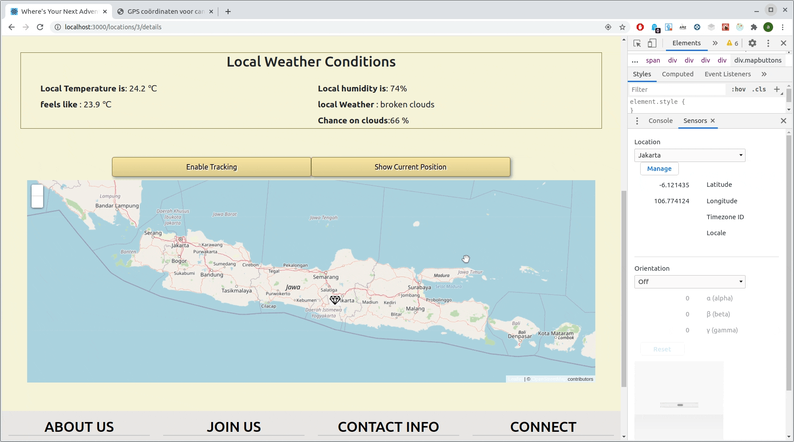

# **Explore Hidden Gems**

:point_right: [See the deployed website here](www.google.com)

## **Table of Content**

- [Introduction](#introduction)
- [About](#about)
- [Demo](#demo)
- [Goals](#goals)
- [User-Stories](#user-stories)
- [Technologies-Used](#technologies-used)
- [APIs-used](#apis-used)
- [Server-Repository](#server-repository)
- [Setup](#setup)
  * [Setup-Client](#setup-client)
  * [Setup-Server](setup-server)

## Introduction

Hi! :wave: I am Antony, this web application is my portfolio project. This is a MVP with a few important features implemented, with More [features](https://github.com/users/SmitnAntonyDv/projects/1) to come in the future.

## About

Have a free day while tracking through Bali? Check posts made by other backpackers on **Explore Hidden Gems** and discover beautifull locations you could visit near you. 
Planning your backpacktrip in Vietnam and need some inspiration? Check some posts to find some locations you want to visit during your trip.
 

**Explore Hidden Gems** is dedicated to backpackers, who want to share and explore locations off the beaten track. 

The App's main concept is to be a platform where Users can view and/or post Must-visit locations. The app offers GPS functionality, a rating system, sorting based on distance between users and suggested location and more.

The app is dynamic and designed for tablet and PC (mobile version coming soon).
All constructive feedback is welcome! you can contact me [here](www.linkedin.com/in/antony-smit) :point_left:

This project was bootstrapped with [Create React App](https://github.com/facebook/create-react-app).

## Demo

 

 

 

## User-Stories 

- As a backpacker . . .  I want to browse a suggestion list from other backpackers about possible MUST-visit locations in a specific backpacker-Country.
- As a backpacker interested in a suggestion . . .  I want to view the details of a post to see a detailed description and the local weather conditions, so I can decide to go visit it.
- As a backpacker interested in a suggestion . . .   I want to have an interactive map, so I can see how close the distance between me and the location.
- as a logged in backpacker. . .   I want to share and post my own MUST-visit location, so other backpackers can find my hidden gem.

### User Stories still being implemented

- As a logged in backpacker . . .  I want to rate and comment on suggested locations to provide other users with additional information, so the post rank increases and more backpackers get to see this amazing post.
- As a logged in backpacker . . .   I want to directly message the author of a post in a private message to gain more insightful information, so I can decide what to bring / not to bring with me.

## Goals

The Goal of this project is to build a full-stack app and consolidating the knowledge I've learned during [this bootcamp](https://codaisseur.com/) as well as learning how to use new technologies through documentation.
 
**Summary**

- Practice full-stacl development.
- Practice learning and implementing new technology independently.
- Practice External API.
- Consolidate and implement knowledge learned through the bootcamp.
- Practicing a Development approach by creating and following User Stories & Wireframes.
- Practicing disciplined git usage with proper commits & brancing.

## Technologies-Used

**Front-End**

- Node.js
- ReactJS
- Redux
- Axios
- Geocode & Reverse-Geocode : GeoLocation
- React-Bootstrap
- Sass
- Bootstrap
- React-Leaflet
- Leaflet

  **Back-End**

- Express
- REST API
- Sequelize ORM
- Postgress
- Axios

## APIs-used

- [OpenWeather](https://openweathermap.org/api) - Freemium Weather API.
- [Restcountries](https://restcountries.eu/) - Open Source Country API.
- [OpenCage](https://opencagedata.com/api) - Freemium Geocoding & reverse-Geocoding API.

## Server-Repository

- The server side of this project is an Express server connected to a Sequelize database.
- Note: you will need both to run this project!
- :point_right: [The Server and more details here.](https://github.com/SmitnAntonyDv/Portfolio-project-Hidden_Gems-BackEnd)

## Setup
### Setup-Client

- Clone the app.
- Cd into the project directory where you cloned the app.
- install dependencies using `npm install`.
- start the development server using `npm run start`.
- client runs on localhost:3000 by default.
- If for whatever reason the Client does not open in your browser after starting the start command, open your browser and open `http://localhost:3000/`.

### Setup-Server

- Clone the [server](https://github.com/SmitnAntonyDv/Portfolio-project-Hidden_Gems-BackEnd).
- Cd into project directory.
- install dependencies using `npm install` inside the directory.
- start the server using `npx nodemon index.js` OR `npm node index.js`
- Server runs on port 4000 by default.
